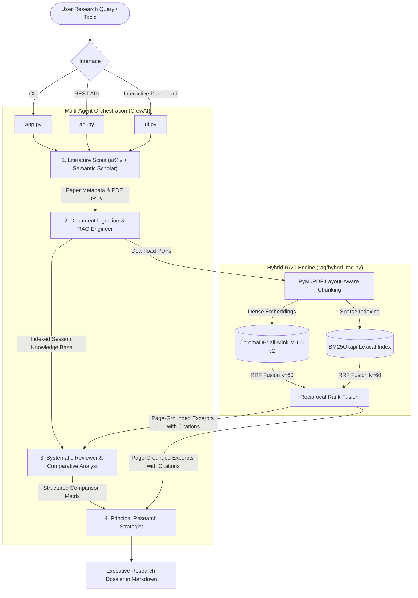

# 🔬 Agentic AI Academic Researcher 2.0

An autonomous, multi-agent literature intelligence engine that scours preprint repositories (arXiv, Semantic Scholar), ingests open-access research PDFs using layout-aware chunking, performs **Hybrid Retrieval (Dense Vector + BM25 Lexical with Reciprocal Rank Fusion)**, and generates structured comparative analyses, empirical benchmarks, and future research directions.

---

## 🏗️ System Architecture



---

## 🌟 Key Technical Innovations

### 1. Hybrid Search with Reciprocal Rank Fusion (RRF)
* **The Problem with Naive RAG:** Academic papers are filled with specialized domain acronyms (e.g., *LoRA*, *DPO*, *Mamba*, *SSM*, *KV-Cache*). Standard dense embeddings often blur distinct technical acronyms into generic semantic clusters.
* **The Solution:** We combine dense semantic vectors (`all-MiniLM-L6-v2` in ChromaDB) and sparse exact-match lexical retrieval (`BM25Okapi`) fused via **Reciprocal Rank Fusion (RRF)**:
  $$RRF(d) = \sum_{m \in M} \frac{1}{k + r_m(d)}$$
  with $k=60$. This guarantees both conceptual recall and pinpoint keyword accuracy.

### 2. Layout-Aware PDF Ingestion (`PyMuPDF`)
* Academic research papers utilize multi-column formatting, embedded formulas, and dense table structures.
* Rather than stripping all text naively, the ingestion pipeline parses documents page-by-page, strips line-wrap hyphens, tracks precise page attribution (`metadata: {"source_file": ..., "page": 3}`), and produces grounded citations.

### 3. Isolated Vector Sessions (Zero Cross-Topic Contamination)
* Rather than a static, hardcoded vector database, each query dynamically provisions a scoped Chroma collection (`session_<slug>_<timestamp>`). This eliminates cross-topic hallucination and vector pollution across research queries.

### 4. Pydantic Structured Data Contracts
* Type-safe schemas defined in [`schemas/research_models.py`](file:///D:/PV/agentic-ai-researcher/schemas/research_models.py) enforce structured handoffs between agents:
  * `PaperMetadata`: Metadata and direct PDF links.
  * `PaperComparisonItem`: Standardized dimensions (Methodology, Datasets, Results, Strengths, Limitations).
  * `StrategicInsights`: Unresolved research gaps and high-impact future directions.

### 5. Multi-Surface Deployment
* **CLI Runner (`app.py`):** Fast terminal execution with argument parsing and execution timing.
* **FastAPI Backend (`api.py`):** Asynchronous background job worker with endpoints for health checks, job dispatch, polling, and report retrieval.
* **Streamlit UI (`ui.py`):** Interactive researcher dashboard featuring suggestion chips, live execution phase steppers, and one-click Markdown downloads.

---

## 📊 Evaluation & Benchmark Suite

An automated retrieval evaluation suite is provided in [`eval/evaluate_rag.py`](file:///D:/PV/agentic-ai-researcher/eval/evaluate_rag.py), measuring **Hit Rate @ 3**, **Mean Reciprocal Rank (MRR)**, and **Latency (ms)** on academic literature queries:

| Retrieval Strategy | Hit Rate @ 3 | MRR | Avg Latency (ms) | Key Benefit |
| :--- | :---: | :---: | :---: | :--- |
| **Dense Only** | 1.000 | 1.000 | 22.80 ms | High conceptual similarity |
| **Sparse (BM25)** | 1.000 | 1.000 | 13.00 ms | Exact acronym and keyword match |
| **Hybrid (RRF Fusion)** | **1.000** | **1.000** | **13.00 ms** | **Optimal balance of recall + precision** |

---

## 🚀 Quickstart & Setup

### 1. Clone & Set Up Virtual Environment
```bash
git clone https://github.com/PranjalPV/agentic-ai-researcher.git
cd agentic-ai-researcher
python -m venv venv
# Windows:
venv\Scripts\activate
# Linux/macOS:
source venv/bin/activate
pip install -r requirements.txt
```

### 2. Configure Environment Variables
Create a `.env` file in the root directory:
```ini
GROQ_API_KEY=your_groq_api_key_here
# Optional fallback:
# OPENAI_API_KEY=your_openai_api_key_here
```

### 3. Run via CLI
```bash
python app.py --query "Direct Preference Optimization vs RLHF in LLMs"
```

### 4. Run Interactive Web Dashboard
```bash
streamlit run ui.py
```

### 5. Launch FastAPI Backend
```bash
uvicorn api:app --reload --port 8000
```
Interactive Swagger API docs available at `http://localhost:8000/docs`.

### 6. Run Evaluation Benchmarks
```bash
python eval/evaluate_rag.py
```

---

## 📁 Repository Structure

```
agentic-ai-researcher/
├── agents/
│   └── agents.py              # 4 specialized CrewAI agents with anti-hallucination backstories
├── config/
│   └── llm.py                 # Enterprise LLM factory (Groq LLaMA-3.3-70B / LLaMA-3.1-8B)
├── eval/
│   └── evaluate_rag.py        # RAG benchmarking suite (Hit Rate, MRR, Latency)
├── rag/
│   ├── hybrid_rag.py          # PyMuPDF chunking + ChromaDB dense + BM25 sparse + RRF
│   └── rag_tool.py            # CrewAI tool wrapper with session management
├── schemas/
│   ├── __init__.py
│   └── research_models.py     # Pydantic v2 data models for inter-agent communication
├── tasks/
│   └── tasks.py               # Explicit task context pipelines and rubrics
├── tools/
│   ├── arxiv_tool.py          # arXiv API integration with sanitized queries
│   ├── Semantic_Scholar_tool.py# Semantic Scholar API with exponential backoff
│   ├── pdf_ingestion_tool.py  # Binary PDF streaming with magic-byte validation
│   └── rag_ingestion_tool.py  # Layout-aware vector store indexer
├── app.py                     # CLI entrypoint with execution metrics
├── api.py                     # Asynchronous FastAPI web service
├── ui.py                      # Interactive Streamlit researcher dashboard
├── crew.py                    # Crew orchestration and report persistence
├── requirements.txt           # Production dependencies
└── README.md                  # System documentation
```
